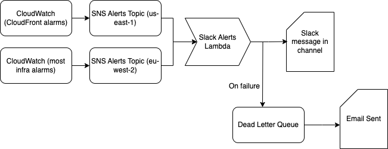

# Alerts from this infrastructure

We define several alarms in this codebase, set to alert us via CloudWatch if something is going wrong. You can find details in the runbook of what alarms might trigger and how to diagnose issues - this document covers how alerts reach us.

We have defined our own lambda function to send messages to slack when an alert is triggered (see modules/slack_alerts_lambda). If this goes wrong, the message should be sent to a dead letter queue, and we should receive an email.

The setup is something like this;

This exists separately in each environment (with no cloudfront / us-east-1 topic for meta)

The lambda deals with the following types of message;
1. Alarm state changed - either triggered or returned to OK
1. Budget alert received
1. ECR image scan findings

It also has a (not very nice) backup for types of messages it doesn't recognise.