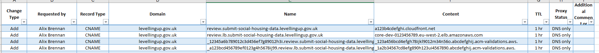

# Creating a new environment from scratch

When setting up a new environment:
1. DNS records will need to be added by DLUHC for certificate validation and to point at the cloudfront distribution and 
app load balancer
2. Secret values will need to be filled in manually
3. The meta account will need updating with additional roles access to the ecr, since this is currently manual
4. A new deployment pipeline will need to be setup

See the process below for detailed steps.

## The process

### Create a new terraform folder

If the environment hasn't been created / defined before:

In the terraform folder, add a new sub-folder with the name of the environment.

Add a `main.tf` file to the folder, and define any infrastructure here (e.g. modules to use). You may also add 
`variables.tf` and/or `outputs.tf` files if necessary. In the `main.tf` file, you may also want to correctly set any local
terraform variables, such as the `prefix`, `rails_env` etc.

Ensure for the backend block in `main.tf` (see the equivalent in other environment folders for examples), you define a 
unique key to store the infrastructure state in (i.e. the full name and extension of the terraform state file). 

Once complete, while `cd`'d into the environment folder, run the following command to prepare terraform:

```terraform init```

### Run an initial apply

Run the command below to create partial infrastructure. 

N.B. we need to ensure we explicitly target the `networking` module, otherwise we get an error when creating the load 
balancer, as there's some kind of dependency that Terraform doesn't quite get.

```terraform apply -target="module.networking" -target="module.front_door" -target="module.application_secrets" -target="module.monitoring_secrets" -var="initial_create=true"```

(This will create the certificates, load balancer, cloudfront distribution, networking and other components which are 
the minimum required for defining the DNS records that DLUHC will need to add. It will also create some app roles and 
secrets; which are necessary before creating the full app).

### Get DNS Records set up

Request DLUHC to add the DNS records for the new environment.

There will be four records, which will be;
* CNAME for the cloudfront domain pointing at the cloudfront distribution
* CNAME for the load balancer domain pointing at the load balancer
* Validation for the cloudfront certificate
* Validation for the load balancer certificate

See the screenshot below for an example of the form DLUHC asked us to complete for the request above (values aren't actual):



Once DLUHC has set up the records, check the certificates have been validated in AWS console (they should have "issued" 
and "success" statuses). N.B. the cloudfront certificate lives in the `us-east-1` region, whereas the load balancer 
certificate lives in `eu-west-2`.


### Fill the application secrets

When doing a full apply the complete application will be created, and will need to read values from the secrets. 
The values for the secrets should therefore be populated beforehand.

You can do this using AWS console - Secrets Manager. Values should be saved as plaintext and without any curly braces 
that the console initially has as a placeholder.

You can find / create values for the following secrets from the given locations:
* `OS_DATA_KEY` = Check / use Ordnance Survey
* `RAILS_MASTER_KEY` = Check application codebase config
* `GOVUK_NOTIFY_API_KEY` = Check / use Gov UK Notify
* `SENTRY_DSN` = Check / use Sentry
* `MONITORING_EMAIL` = Email address for monitoring subscriptions

### Update meta environment

In the [meta/main.tf](../terraform/meta/main.tf) file, add the ARN of the `task-execution` role from the newly created 
environment to the ECR module's `allow_access_by_roles` parameter. 

`cd` into the meta folder and run `terraform apply` to update the meta environment with this change.

### Run a full apply

Now run a full apply using the command below (without targeting any modules or setting the `initial_create` var, and while
`cd`d into the environment to be created folder).

```terraform apply```

If there are any issues creating the infra, it may be worth retrying the command a short while later in case AWS / Terraform
was unable to configure a component or resource quickly enough before moving onto the next. Otherwise, you will need to 
investigate the cause of the error.

### Set up and try running the deployment

In the Core App codebase [here](https://github.com/communitiesuk/submit-social-housing-lettings-and-sales-data), you
will need create a new pipeline for the environment (you can re-use the jobs and configuration in existing pipelines where
appropriate).

For the `aws_deploy` workflow, ensure you pass in the new account id, resource prefix and environment name.

Once setup, run the deployment pipeline in order to update the ECS task definitions to run the right image from the ECR 
(the pipeline may fail on the db migration stage depending on the state of your DB, see the next step for info).

### Set up the database

If you're not restoring the database from a backup / migrating it from elsewhere, and the db migration stage failed
in the deployment above, run a `db:setup` rake task (using the `ad_hoc` task definition to spin it up from the app image, 
with a command override).

Alternatively, if the db migration stage ran successfully, you can run a `db:seed` rake task separately (also using the 
`ad_hoc` task definition), to populate the DB with some initial data.

### Run a complete deployment

Finally, if the deployment pipeline didn't run completely the first time due to the db migration stage, re-run it in order 
to bring the infrastructure and application to a complete and ready-to-use state.
